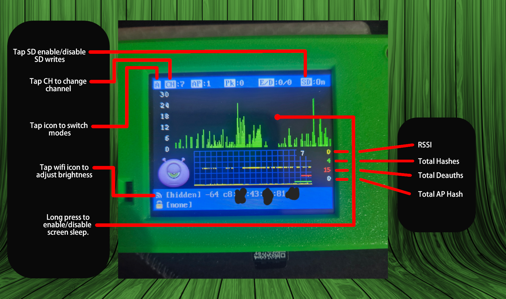

# ESP32‑WiFi‑Hash‑Monster (CYD / ESP32‑2432S028R Touch Port)

A lightweight, touch‑driven port of **ESP32 WiFi Hash Monster** for the **Cheap Yellow Display (CYD) ESP32‑2432S028R**.  
This build focuses on **smooth on-device UI**, **low RAM usage**, and **hands‑on scanning/wardriving workflows** (channel hop, SD logging, EAPOL/deauth counters, RSSI graphing).

> Credits / lineage  
> - Original project by [Galile0 (G4lile0)](https://github.com/G4lile0/ESP32-WiFi-Hash-Monster)  
> - Based largely on: **PacketMonitor32** (by @Spacehuhn)  
> - CYD touch port by @ATOMNFT**

---

---

## Features

### Touch UI (no buttons)
Designed for CYD’s touchscreen:
- **Tap** controls for channel hopping mode, channel step, and SD toggle
- **Long press** gesture for “Incognito” brightness toggle
- Optional touch transform cycling (swap/invert axes) via serial

### SD logging (CS=5)
- SD is used for packet logging (when enabled)
- Boot sequence checks SD, prunes zero files, and opens a new capture file

### Low‑RAM friendly rendering
- Uses small sprites where possible (header/footer/graph1/units/optional face sprite)
- **Graph2 is drawn directly on the TFT** using a history buffer (no large sprite)
- Graph2 matches the original feel:
  - **scroll-left history**
  - **scrolling grid**
  - **scrolling channel numbers** stamped when channel changes

### Live stats + visuals
- Packet counter and AP count
- EAPOL + deauth counters (current + totals)
- RSSI tracking and graphing
- “Monster” face reacts to activity (happy/bored/sleep/scared/love/angry)

---

## Hardware

- **Cheap Yellow Display (CYD)**: ESP32‑2432S028R (240×320 TFT + touch)

---

## Controls (Touch)

### Header (top bar, `y <= 30`)
- **Tap left icon area (x < 30)**: cycle channel hop mode  
  - `C` = fixed channel  
  - `A` = auto hop every interval  
  - `S` = smart hop (based on “interestingness”)
- **Tap middle-left (30 <= x < 110)**: increment channel by 1
- **Tap right (x >= 240)**: toggle SD logging on/off

### Footer left icon block (lower-left)
- **Tap lower-left icon area**: cycle TFT brightness (100 → 70 → 40 → 10 → …)

### Long press (Incognito)
- **Long press anywhere below the header** (~6s): toggle “Incognito Mode”
  - Dims screen backlight (and LEDs if wired/used)

---

## UI / Graphs

### Graph1 (top graph)
- Packet volume history (scrolling)
- Scales automatically to the recent max

### Graph2 (lower mini graph)
Drawn directly on TFT using a history buffer:
- RSSI trace (yellow)
- EAPOL markers (green)
- Deauth markers (red)
- **Scrolling grid** that moves with the history
- **Scrolling channel labels** stamped when channel changes (like the original)

---

## Legal / Ethical notice

This project involves Wi‑Fi monitoring concepts (promiscuous mode, management frames, EAPOL detection).  
Use only on networks you own or have explicit permission to test.  
You are responsible for complying with local laws and regulations.

---

## Credits

- **@g4lile0** — ESP32 WiFi Hash Monster concept/UI & purple monster images.
- **@Spacehuhn** — PacketMonitor32 foundation
- **@ATOMNFT** — CYD ESP32‑2432S028R touch port + UI/graph changes
